<!-- ===================== HEADER ===================== -->

<picture>
  <source media="(prefers-color-scheme: dark)" srcset="https://github-readme-stats-sigma-rosy-28.vercel.app/api?username=ajay01A&show_icons=true&count_private=true&include_all_commits=true&hide_rank=true&hide_border=true&title_color=22D3EE&icon_color=A78BFA&text_color=94A3B8&bg_color=0A101F&card_width=500" />
  
</picture>
<picture>
  <source media="(prefers-color-scheme: dark)" srcset="https://github-readme-stats-sigma-rosy-28.vercel.app/api/top-langs/?username=ajay01A&layout=compact&langs_count=8&hide_border=true&title_color=22D3EE&text_color=94A3B8&bg_color=0A101F&card_width=500" />
  
</picture>

---


<!-- ===================== GITHUB STATS ===================== -->

---

## 🔥 GitHub Streak

<div align="center">


</div>

---

<!-- ===================== CONTRIBUTION ===================== -->

## 🐍 My Contribution Snake

<div align="center">

<picture>
  <source media="(prefers-color-scheme: dark)" srcset="https://raw.githubusercontent.com/arifhaxn/arifhaxn/output/snake-dark.svg" />
  <source media="(prefers-color-scheme: light)" srcset="https://raw.githubusercontent.com/arifhaxn/arifhaxn/output/snake-light.svg" />
  
</picture>

</div>

<br/>
<br/>
<div align="center">

</div>

---
## 🛠️ Tech Stack

### 💻 Languages

<p align="left">


</p>

### 🌐 Frontend

<p align="left">


</p>

### ⚙️ Backend

<p align="left">


</p>

### 🗄️ Database & Tools

<p align="left">


</p>

---


<!-- ===================== PROJECTS ===================== -->

## 🚀 Featured Projects

### ✈️ Trip Planner

A modern trip planning web application designed to help users organize and explore their travel plans.

**Tech:** HTML • CSS • JavaScript • React • Node.js • Express

🔗 **Repository:** [View Project](https://github.com/ajay01A)

---

### 🌐 Personal Portfolio

A responsive developer portfolio showcasing my skills, projects, education and contact information.

**Tech:** HTML • CSS • JavaScript

🔗 **Repository:** [View Project](https://github.com/ajay01A)

---

### 📊 Data Analytics Projects

Projects focused on data analysis, visualization and extracting meaningful insights from datasets.

**Tech:** Python • Data Analysis • Visualization

🔗 **GitHub:** [Explore Projects](https://github.com/ajay01A?tab=repositories)

---

<!-- ===================== GOALS ===================== -->

## 🎯 2026 Goals

```text
☑ Improve Advanced DSA
☑ Build production-level projects
☑ Learn advanced backend development
☑ Build AI-powered applications
☑ Contribute to Open Source
☑ Create a strong developer portfolio
☑ Become a better problem solver
